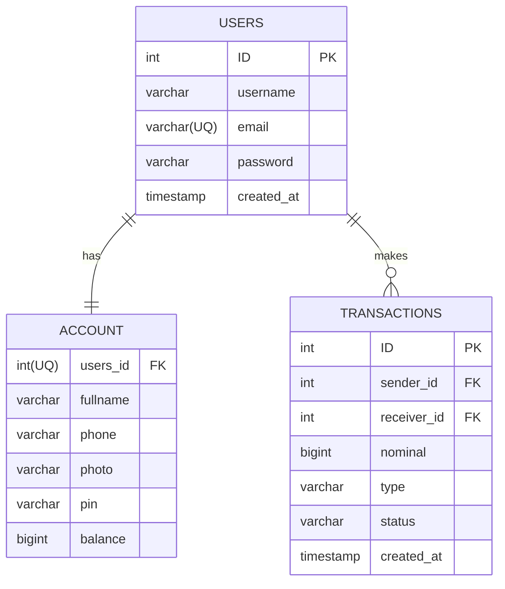
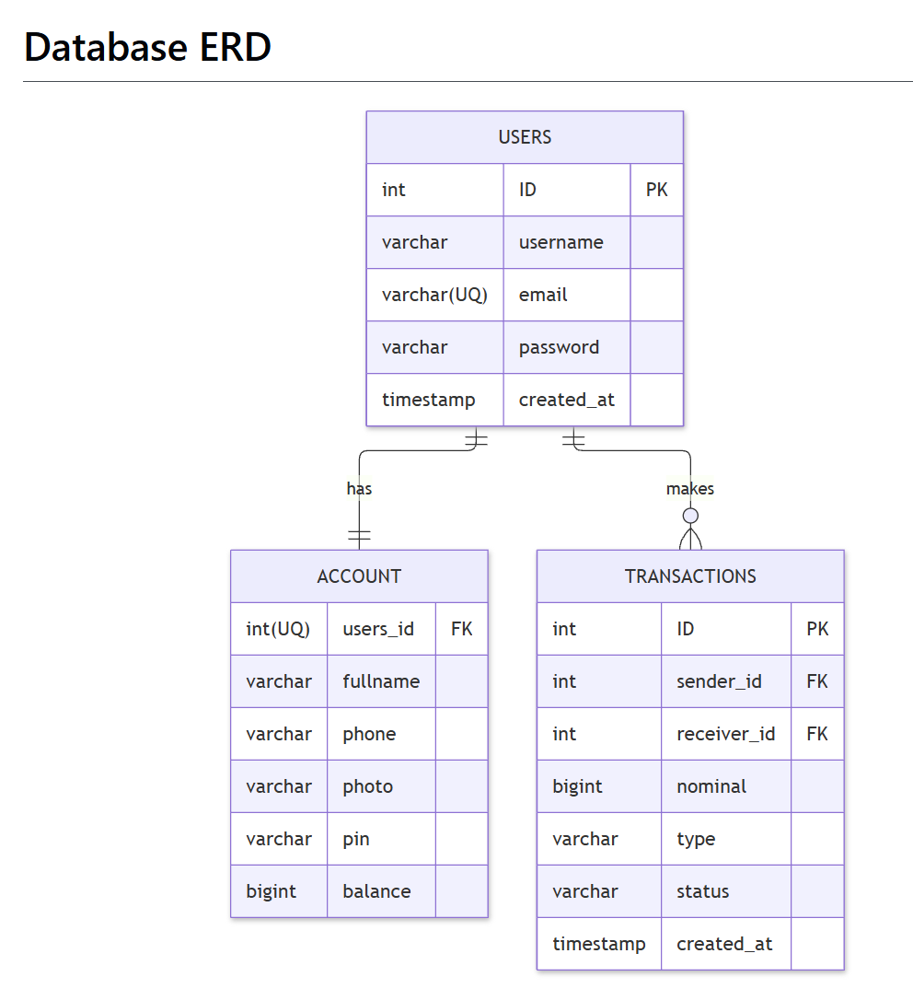

# Database ERD

```mermaid
erDiagram
    USERS ||--|| ACCOUNT : has
    USERS ||--o{ TRANSACTIONS : makes
    USERS{
        int ID PK
        varchar username
        varchar(UQ) email
        varchar password
        timestamp created_at
    }
    ACCOUNT{
        int(UQ) users_id FK
        varchar fullname
        varchar phone
        varchar photo
        varchar pin
        bigint balance
    }
    TRANSACTIONS{
        int ID PK
        int sender_id FK
        int receiver_id FK
        bigint nominal
        varchar type
        varchar status
        timestamp created_at
    }
```

## Screenshot ERD
